## Project Overview 
    A food delivery app built using React Native and Expo.
    This Project is part of the assignment at ChaiCode.com Mobile Development Cohort.

## Tech Stack
   - React Native
   - Expo
   - Typescript
   - Zustand

## How to run locally
    git clone https://github.com/shivamkumar413/Food_Delivey_App
    cd Food_Delivey_App
    npm install
    npx expo start

    Scan the QR Code using Expo Go app.

## Project structure
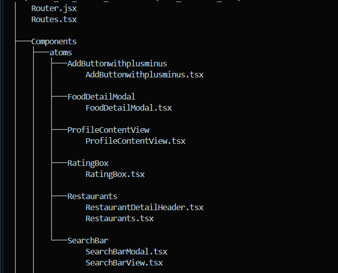
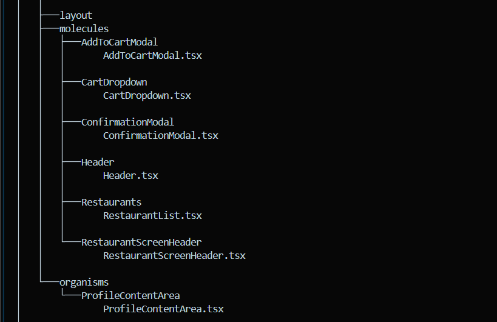
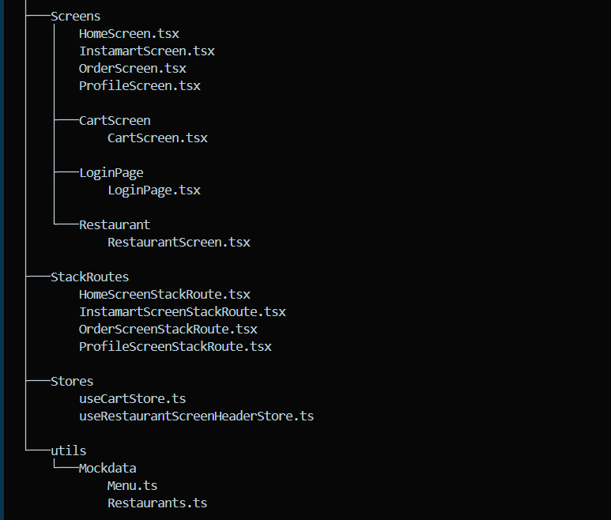

## Screenshots
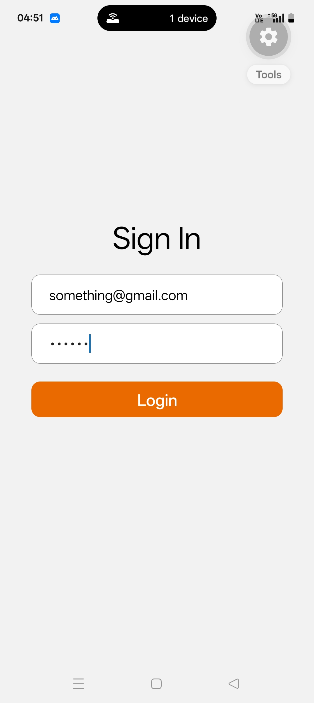
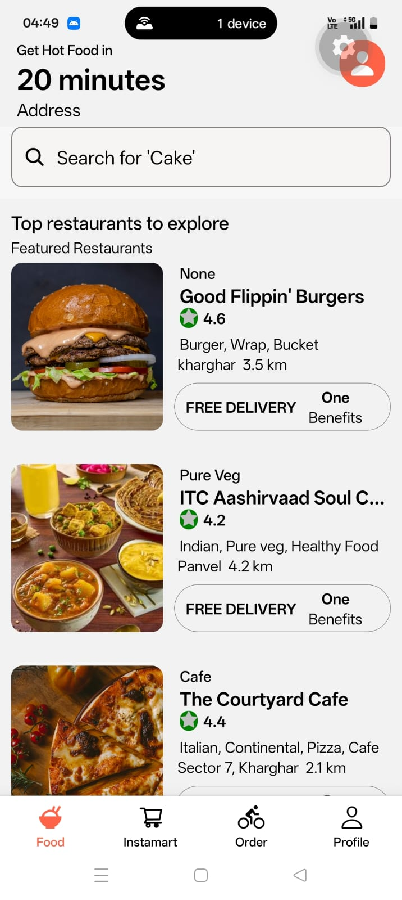
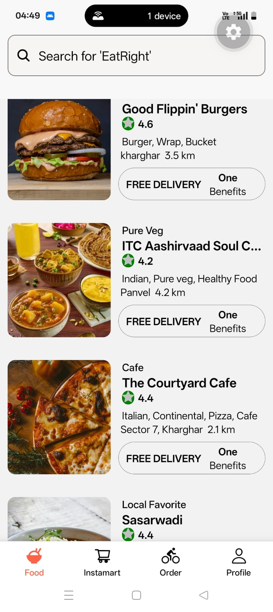
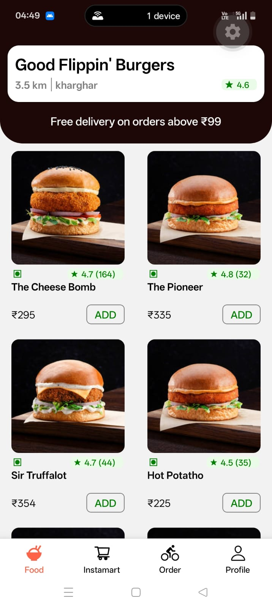
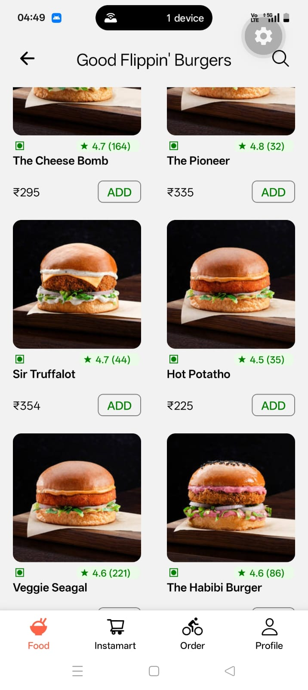
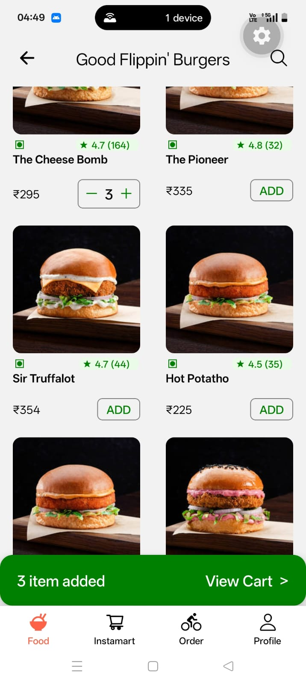
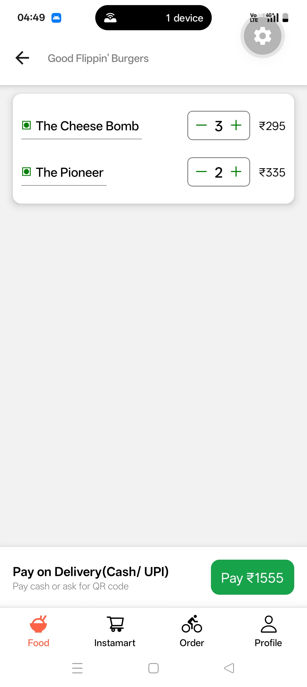
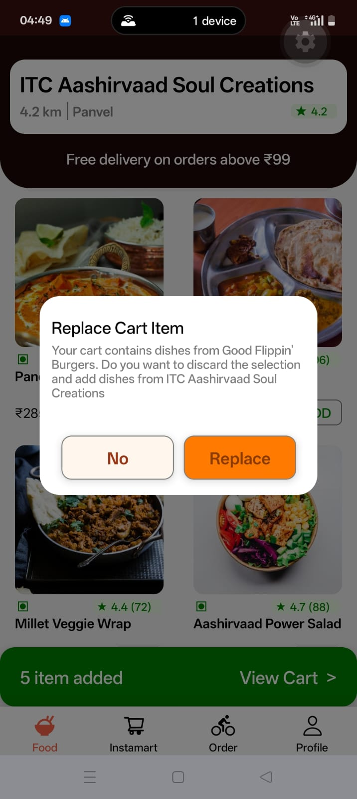
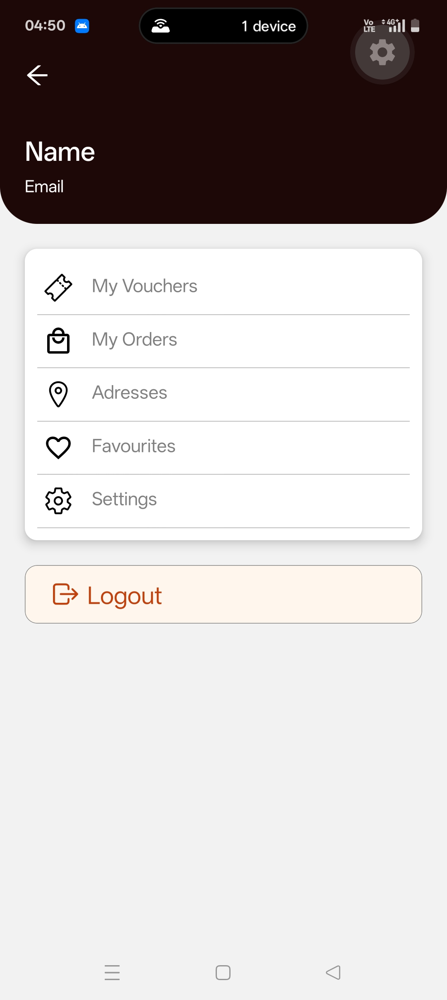

## Assumptions
    - Login : Can login using any mock email and password.
    - Restaurants and menu data are locally hardcoded. 

